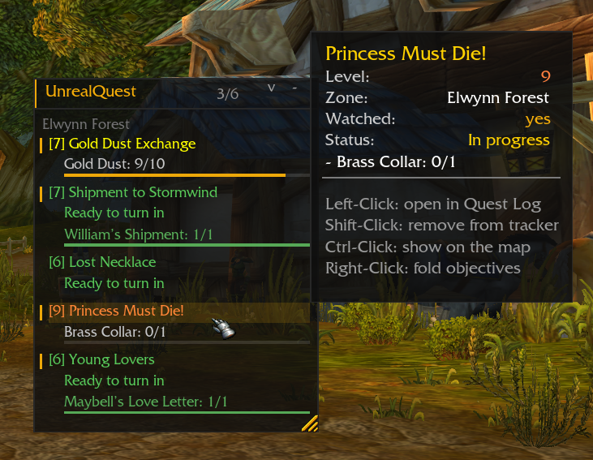
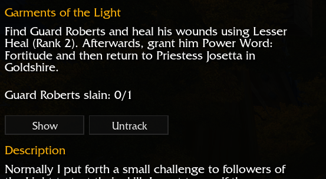
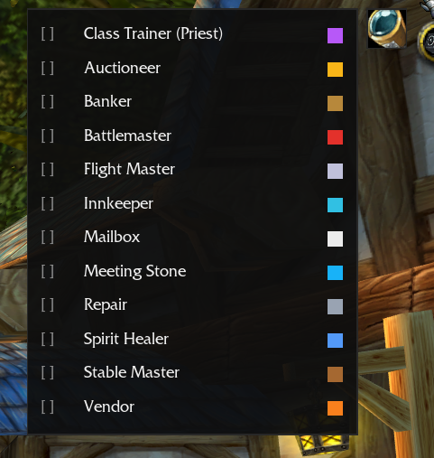
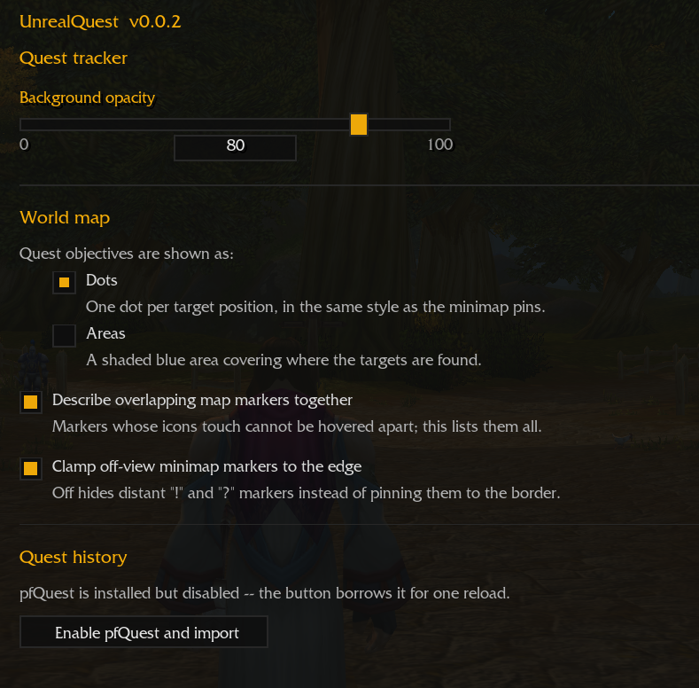
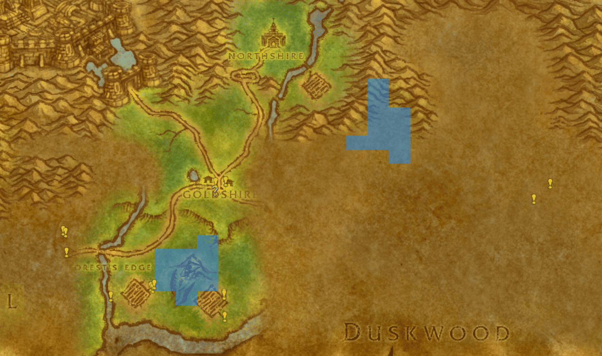
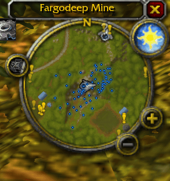
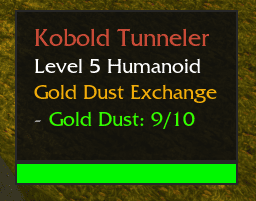
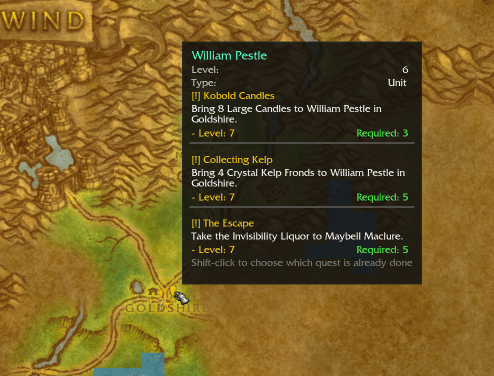

# UnrealQuest

See every objective. Spend less time searching. Adventure more.

**Developed from scratch exclusively for the Unreal Azeroth / Emberveil client — not a fork or port.**

> [!IMPORTANT]
> ## Install UnrealQuest
>
> 1. [Download the latest release](https://github.com/Tom75VN/UnrealQuest/releases/latest/download/UnrealQuest.zip).
> 2. Extract the archive into `Azeroth\Interface\AddOns\`.
> 3. Confirm that `UnrealQuest.toc` is directly inside the `unrealQuest` folder.
> 4. Launch the game or reload the interface.

UnrealQuest turns questing into exploration instead of guesswork. It is designed and optimized specifically for Unreal Azeroth / Emberveil, with every feature built around the client you actually play.

## Main benefits

- See objectives, available quests and turn-ins directly on the world map with dots or areas, `!` and `?` markers, a different color for each quest and patrol paths that stay visible while a moving quest NPC still has a marker. The `?` turns orange the moment a quest is ready to hand in.
- Open any zone's map and read its quest points, not only the zone you are standing in.
- Follow nearby quest creatures and objectives from your minimap without constantly reopening the world map, with a tooltip on every marker.
- Watch every quest you need in a movable tracker window, beyond the client's native five-quest limit, grouped by zone with live objective progress, quest levels and tracking that survives a reload.
- Narrow the tracker to the zone you are in, and keep a quest whose objectives are here even when the quest log files it under another zone.
- Find nearby auctioneers, bankers, flight masters, mailboxes, vendors and class trainers from the quest tracker's NPC finder.
- Put treasure chests, herbs, mining veins, fishing pools, rare, elite and boss creatures and dungeon and raid entrances on both maps from the same menu, each herb, vein and entrance drawn with its own icon, and each ranked creature wearing a silver, gold or red star for its rank.
- Be warned when you come near a rare, rare elite or boss creature's known spawn, with a movable alert card and a sound you choose.
- Buy quest items without hunting for the shop: when a quest asks for something a trader sells, the sellers in the zone are marked on both maps with the NPC finder's vendor icon, and the mark clears once you have the item.
- See live quest progress in creature tooltips and recognize relevant targets through automatic quest marks.
- Read every marker in one tooltip when several land on the same spot, instead of losing the ones underneath.
- Track more reliably, with far fewer ambiguously matched quests, no other-faction quest givers and no city guards or dungeon interiors crowding the map.
- Adjust everything from a standalone settings window that also plugs into unrealUI when it is installed.
- Import completed-quest history from pfQuest so finished quests do not reappear on the map.
- Read the whole interface in English, French, Russian or Simplified Chinese, chosen with the flag row in the settings window -- or automatically matched to unrealUI's language when that addon is installed.

## Stop searching. Start adventuring.

Azeroth should feel mysterious, not frustrating. UnrealQuest gives you the direction you need while keeping the journey in your hands. Objective areas guide you toward the right part of the world, nearby targets become easier to spot, and useful quest information appears exactly when you need it.

No more circling the same field wondering where a creature spawns. No more forgetting which NPC wanted an item. No more losing your tracked quests after a reload. UnrealQuest keeps the adventure moving so you can spend more time exploring, fighting and finishing the stories you started.

Install UnrealQuest and experience questing built specifically for Unreal Azeroth.

## Screenshots

### Track every quest you need

The movable tracker groups quests by zone, shows live objective progress and is not limited to the client's native five watched quests. Hover a quest for details and quick controls.

### Control tracking from the quest log

Show a quest on the map or add and remove it from the custom tracker without leaving the quest log.

### Find nearby services

Choose the NPC categories you need from the movable finder, including auctioneers, bankers, flight masters, vendors and your class trainer.

### Configure the experience

Adjust tracker opacity, choose objective dots or areas, control overlapping-marker details and decide how off-screen minimap markers behave.

### Turn your world map into a questing compass

Blue objective areas show you where to search, while `!` and `?` markers reveal where new adventures begin and completed journeys end.

### Find nearby quest targets at a glance

The minimap keeps nearby objectives visible while you move, helping you choose your next direction without breaking the rhythm of exploration.

### Know why every creature matters

Hover a relevant creature to see the connected quest and your live objective progress immediately.

### Discover quests before you make the journey

Quest-giver tooltips show the available quests, their levels and requirements directly from the map, helping you decide where to go next.

## Designed for Unreal Azeroth

UnrealQuest is not a generic quest addon forced onto an unfamiliar client. Its tracking, maps, minimap, tooltips and compatibility layer are engineered around the behavior and limitations of Unreal Azeroth / Emberveil. The result is a focused questing experience that feels native to this world.

Use `/uq` in game to view the available commands and diagnostics.

Use the tracker header's spyglass to select or clear service categories; the
class-trainer row automatically shows only trainers for your character's class.
Below the divider are dungeon entrances and the world-node categories --
chests, herbs, mines, fishing pools and rare/elite/boss creatures. Dungeon and
raid entrances use distinct icons; nodes show the required gathering skill or
creature level in each pin's tooltip. Herb and vein pins carry their own artwork,
so Peacebloom, Silverleaf and Copper Vein are told apart at a glance instead of
sharing one category icon.

## Languages

The interface is available in English, French, Russian and Simplified Chinese.
Pick one with the flags in the top-right of the settings window. If unrealUI is
installed, UnrealQuest follows the language set there instead and shows no flags
of its own -- one setting for both addons, and neither one requires the other.

Quest, creature and zone NAMES are a separate matter: they come from the
bundled world data and follow your CLIENT's language, because they have to match
what the game itself shows. Playing an English client in French therefore gives
a French interface around English quest names, which is correct.

Whether Cyrillic and Chinese characters draw at all depends on the client's own
font. The flags stay recognizable either way, so the way back is always one
visible click.

## Version

Current release: 0.2.1

## License

UnrealQuest is released under the MIT License. Bundled world data originates from VMaNGOS and was packaged by pfQuest under the MIT License; see [LICENSE](LICENSE) and [Database/CREDITS.md](Database/CREDITS.md).
